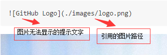

# 带你学习如何编写github-README.md文件
## 标题
```
# This is an tag
## This is an tag
###### This is an tag
```
# This is an tag
## This is an tag
###### This is an tag


## 斜体
```
*This text will be italic*
_This text will be italic_
```
*This text will be italic*
_This text will be italic_


## 列表
```
* Item 1
* Item 2

1. Item 1
2. Item 2
3. Item 3

- Item1
- Item2
	- Item3
	- Item4
```
* Item 1
* Item 2

1. Item 1
2. Item 2
3. Item 3

- Item1
- Item2
	- Item3
	- Item4


## 图片
```

```



## 链接
```
http://github.com
[GitHub](http://github.com)
```
http://github.com
[GitHub](http://github.com)


## 块引用
```
As Kanye West said:
> We're living the future so <br>
> the present is our past.
```
As Kanye West said:
> We're living the future so <br>
> the present is our past.

## 行内代码引用
```
I think you should use an
`<div>` element here instead.
```
I think you should use an
`<div>` element here instead.

## 不同编程语言代码块
```html
html

<!DOCTYPE html>
<html>
<head>
	<title></title>
</head>
<body>
	<div>hello world</div>
</body>
</html>
```

```javascript
javascript

window.onload = function(){
	console.log(123)
}
```

```php
php

$arr = array('name', 'age');

foreach($arr as $key => $value) {
	echo $value;
}
```